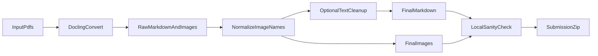

# PDF Parsing Baseline (Docling)

Baseline для хакатона: конвертация PDF -> Markdown с сохранением структуры документа.

Решение использует [Docling](https://github.com/docling-project/docling) и добавляет постобработку под требования хакатона:

- нормализация имен картинок в формат `doc_<id>_image_<order>.png`;
- базовая очистка повторяющихся колонтитулов/маркеров страниц;
- sanity-проверка результатов и сборка финального `submission.zip`.

## Приоритет метрики (по уточнению организаторов)

1. Таблицы
2. Текст
3. Структура
4. Изображения

Именно в таком порядке лучше вносить улучшения в пайплайн.

## Структура репозитория

```
├── baseline/
│   ├── docling_baseline.py   # основной пайплайн PDF -> MD
│   ├── text_cleanup.py       # постобработка текста (шумы/колонтитулы)
│   ├── table_cleanup.py      # нормализация Markdown-таблиц
│   └── evaluate_md.py        # sanity-check + сравнение с эталоном + zip
├── dataset/
│   └── public/
│       ├── pdfs/
│       └── ground_truth/     # если доступен в вашей копии
├── evaluate.py               # обратная совместимость (делегирует в baseline.evaluate_md)
├── pyproject.toml
└── README.md
```

## Быстрый старт

### 1) Установка зависимостей

Вариант с `uv`:

```bash
uv sync
```

Вариант через `venv`:

```bash
python -m venv .venv
.venv\Scripts\pip install -e .
```

### 2) Запуск baseline

**Для хакатона (таблицы важнее скорости):** по умолчанию включён **TableFormer** (`do_table_structure=True`). Не передавайте `--no-table-structure`, иначе таблицы из PDF часто превращаются в один абзац в виде `| ...весь текст... |` без колонок — как на ваших скриншотах.

Пробный запуск (2-5 файлов):

```bash
python -m baseline.docling_baseline ^
  --input-dir dataset/public/pdfs ^
  --output-dir output/run1 ^
  --max-files 5
```

Полный запуск (рекомендуется для сабмита):

```bash
python -m baseline.docling_baseline ^
  --input-dir dataset/public/pdfs ^
  --output-dir output/full
```

Только для отладки скорости (таблицы будут хуже):

```bash
python -m baseline.docling_baseline ^
  --input-dir dataset/public/pdfs ^
  --output-dir output/fast ^
  --fast
```

Продолжить после обрыва:

```bash
python -m baseline.docling_baseline ^
  --input-dir dataset/public/pdfs ^
  --output-dir output/full ^
  --skip-existing
```

### 3) Параметры качества/скорости

- `--no-ocr` - быстрее на PDF с текстовым слоем.
- `--ocr-mode {auto,on,off}` - режим OCR:
  - `auto` (по умолчанию): если в PDF есть текстовый слой, OCR выключается для этого файла;
  - `on`: всегда OCR;
  - `off`: всегда без OCR.
- `--ocr-languages ru,en` - языки OCR (для кириллицы держите `ru,en`).
- `--no-table-structure` - быстрее; **сильно ломает таблицы** (лучше не использовать для финального решения).
- `--fast` - сочетание `--no-ocr` и `--no-table-structure` для быстрых прогонов.
- `--full-quality` - более точные таблицы, но медленнее.
- `--device {auto,cpu,cuda,mps}` - выбор устройства.
- `--no-text-cleanup` - отключить эвристики очистки повторов в тексте.

Важно: первый запуск может быть долгим из-за загрузки весов layout/OCR/table.

Для вашей проблемы с «ломающейся» кириллицей в таблицах рекомендуется:

```bash
python -m baseline.docling_baseline ^
  --input-dir dataset/public/pdfs ^
  --output-dir output/full ^
  --ocr-mode auto ^
  --ocr-languages ru,en
```

Это уменьшает OCR-ошибки в цифровых PDF и сохраняет OCR для сканов.

### Windows и картинки

В `docling_baseline.py` ссылки на изображения приводятся к виду `images/doc_<id>_image_<k>.png` (прямые слеши), файлы копируются в `output/.../images/`. Это нужно, чтобы не оставались абсолютные пути во временной папке и чтобы проверка «локальные ссылки -> существующий файл» проходила.

## Локальная проверка качества

Sanity-check по результатам:

```bash
python -m baseline.evaluate_md --input-dir output/full
```

Если есть эталонный каталог `ground_truth`, можно смотреть текстовое сходство:

```bash
python -m baseline.evaluate_md ^
  --input-dir output/full ^
  --ground-truth-dir dataset/public/ground_truth
```

## Сборка submission.zip

Архив должен содержать только:

- `document_*.md`
- `images/*.png`

Команда:

```bash
python -m baseline.evaluate_md --help
build-submission --source-dir output/full --output submission.zip
```

Либо напрямую из Python:

```python
from pathlib import Path
from baseline.evaluate_md import build_submission_zip
build_submission_zip(Path("output/full"), Path("submission.zip"))
```

## Архитектура пайплайна



## Формат выхода

```
output/
├── document_001.md
├── document_002.md
├── ...
└── images/
    ├── doc_1_image_1.png
    ├── doc_1_image_2.png
    ├── doc_2_image_1.png
    └── ...
```

- имя `.md` совпадает с PDF (`document_001.pdf` -> `document_001.md`);
- картинки строго в `images/` и с именами `doc_<id>_image_<order>.png`;
- `<id>` без ведущих нулей.
